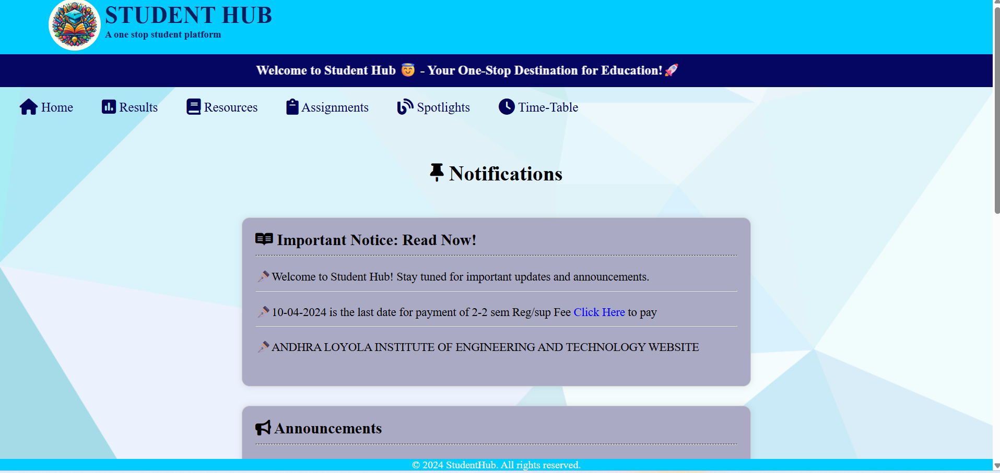
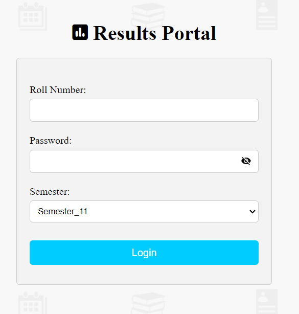

# 🎓 StudentHub

**StudentHub** is a simple and dynamic web application built with **PHP** to help students stay updated with college activities and access important academic information in one place.

---

## 📷 Screenshots

### 🏠 Homepage

### 📊 Results Page

## 📌 Features

- 🏠 **Homepage**
  - Displays latest news and updates such as:
    - Cultural fests
    - Fee payment deadlines
    - College announcements

- 📊 **Results Page**
  - Allows students to view their academic results quickly and easily.

---

## 🛠️ Technologies Used

- **Frontend**: HTML, CSS
- **Backend**: PHP
- **Database**: MySQL 

